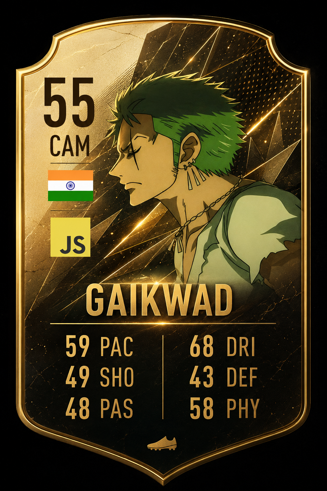

# Hi there, I'm Suraj Gaikwad 👋

### 💻 Full Stack Developer | MCA Student | Problem Solver

> *"We don't just sit around and wait for other people. We just make, and we do."* ⚛️

---

## 🙋‍♂️ About Me

I'm a passionate developer based in **Pune, India**, who enjoys building real-world web applications and solving programming challenges.

- 🌍 **Location:** Pune, India
- 🎓 MCA Student
- 💻 Passionate about Web Development
- 🚀 Currently learning MERN Stack & DSA
- 🎯 Goal: Become a Software Engineer
- 📫 Reach me on LinkedIn or GitHub — links below!

---

## 🌐 Connect with Me

---

## 🚀 Featured Projects

<table>
<tr>
<td width="50%">

### 🎨 CSS Animation
🔗 [View Repo](https://github.com/surajgaikwad2004/CSS-animation-)
- Free CSS animation library
- Pure HTML & CSS
- Open Source

</td>
<td width="50%">

### 💼 React Portfolio
🔗 [Live Demo](https://surajgaikwad2004.github.io/creative-portfolio/)
- Personal portfolio
- Built using React
- Responsive Design

</td>
</tr>
<tr>
<td width="50%">

### 🕷️ Spider-Verse
🔗 [View Repo](https://github.com/surajgaikwad2004/Spider-Verse)
- Spider-Man themed website
- CSS Animation
- Creative UI

</td>
<td width="50%">

### 🎨 Creative Portfolio
🔗 [View Repo](https://github.com/surajgaikwad2004/creative-portfolio)
- Personal Portfolio
- HTML, CSS, JavaScript

</td>
</tr>
<tr>
<td width="50%">

### 💻 LeetCode Solutions
🔗 [View Repo](https://github.com/surajgaikwad2004/Leetcode-)
- DSA Problems
- Interview Preparation
- Regular Updates

</td>
<td width="50%">

### ✨ More coming soon!
🔗 Stay tuned
- New projects in progress
- MERN stack apps
- DSA practice sets

</td>
</tr>
</table>

---

## 🛠 Tech Stack

---

## 📈 Contribution Graph

---

## ⭐ Thanks for visiting my profile!

If you like my work, consider giving a ⭐ to my repositories.

